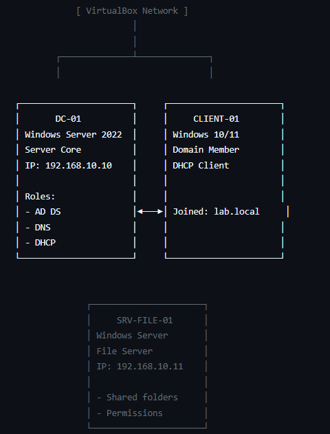
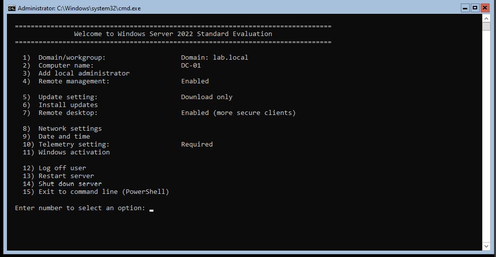
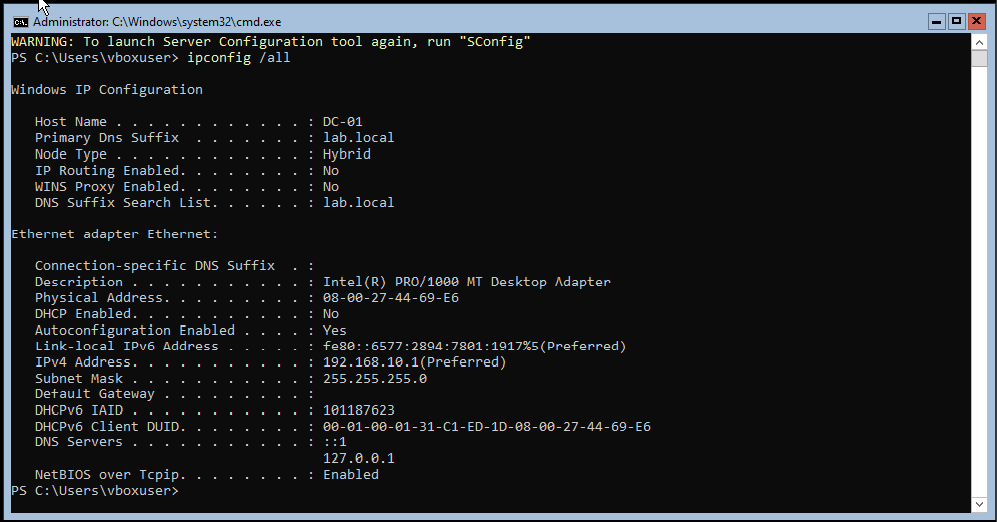
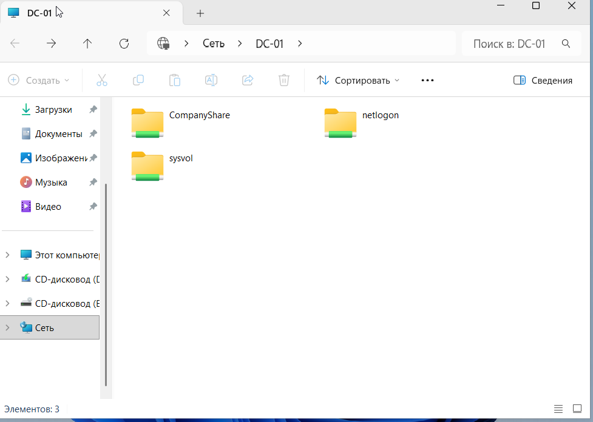

# Windows Server Lab: Развертывание и автоматизация инфраструктуры

Практический проект по проектированию, настройке и администрированию серверной инфраструктуры на базе **Windows Server 2022 (включая Server Core)**. В ходе проекта была развернута отказоустойчивая корпоративная сеть с базовыми сетевыми службами.
---
##  Технологический стек и инструменты
* **ОС сервера:** Windows Server 2022 Standard (Server Core)
* **ОС клиента:** Windows 10/11 Professional
* **Среда виртуализации:** Oracle VM VirtualBox
* **Автоматизация и CLI:** PowerShell, CMD, Sconfig
* **Службы и роли:** Active Directory Domain Services (AD DS), DNS-сервер, DHCP-сервер, File Server
---

#  Архитектура лабораторной сети (Network Topology)
Инфраструктура развернута внутри изолированной сети VirtualBox Network. Взаимодействие узлов и доменная структура организованы следующим образом:

##  Что было реализовано в рамках проекта

### 1. Подготовка и базовая настройка Windows Server Core
* Развернута оптимизированная редакция **Windows Server Core 2022** на узле `DC-01` для снижения утилизации ресурсов хоста, уменьшения размера дискового пространства и повышения безопасности системы за счет минимизации поверхности атаки.
* Проведена первичная инициализация и конфигурация сетевых интерфейсов (задан статический IPv4-адрес, маска, шлюз, DNS) и переименование серверов через встроенную утилиту `sconfig` и PowerShell CLI.

### 2. Развертывание доменных служб (Active Directory & Network Services)
* Развернута роль **AD DS**, создан новый лес и доменная зона `lab.local`.
* Настроен локальный **DNS-сервер** для корректного разрешения доменных имен внутри тестовой лаборатории.
* Сконфигурирован **DHCP-сервер** с пулом адресов для автоматической конфигурации сетевых параметров клиентских машин (узел `CLIENT-01`).
* Успешно выполнена процедура ввода клиентской рабочей станции `CLIENT-01` в домен `lab.local`.

### 3. Файловый сервер и разграничение прав
* В структуру сети добавлен выделенный сервер `SRV-FILE-01`.
* Настроена роль файлового сервера, созданы общие сетевые папки (Shared Folders) и разграничены права доступа (NTFS & Share permissions) для пользователей домена.

### 4. Консольное администрирование и автоматизация обслуживания
* Отработаны навыки полноценного администрирования ОС Windows Server без использования графической оболочки (GUI).
* Протестированы сценарии безопасного, удаленного и корректного завершения работы системных служб и самого сервера. 
* Для предотвращения зависания сессий и служб при регламентном обслуживании настроен механизм принудительного и форсированного выключения/перезагрузки узлов с использованием командлетов `Stop-Computer -Force` и `Restart-Computer -Force`, а также утилиты `shutdown /s /t 0`.

---

##  Траблшутинг и оптимизация тестового стенда

* **Оптимизация производительности:** При одновременном запуске контроллера домена, файлового сервера и клиентской машины на рабочей станции администратора возникала высокая нагрузка на аппаратную часть (CPU и RAM). Проблема была решена развертыванием ключевых ролей на базе редакции **Server Core**. Это позволило снизить потребление оперативной памяти сервером `DC-01` в режиме простоя до ~1.2 ГБ (вместо 2.5+ ГБ у версии с GUI) и обеспечило плавную работу всего стенда.
* **Обеспечение целостности данных при выключении:** Чтобы исключить повреждение доменной базы данных `NTDS.dit` и файлов на общем сервере при внезапном или некорректном завершении работы ВМ, были внедрены и задокументированы CLI-скрипты для контролируемого закрытия активных пользовательских сессий перед остановкой ОС.

---
##  Результаты тестирования и демонстрация работы

Ниже представлены подтверждения успешного развертывания и функционирования элементов лабораторного стенда:

### 1. Тестирование сетевых служб и статуса Server Core
В ходе первоначальной настройки контроллера домена на базе Server Core через утилиту `sconfig` были успешно применены сетевые параметры, изменено имя хоста на `DC-01` и инициализирован домен `lab.local`:

### 2. Верификация сетевых параметров интерфейса через PowerShell
С помощью команды `ipconfig /all` выполнена проверка сетевой конфигурации контроллера домена. Подтвержден статический IPv4-адрес, отключенный DHCP-клиент на сервере, а также корректное указание локального DNS-сервера (`127.0.0.1`) для обслуживания доменной зоны:

### 3.Доступ к общим ресурсам файлового сервера с клиента
Проверена доступность сетевых каталогов на сервере `DC-01` с клиентской рабочей станции. Отображаются системные доменные директории (`netlogon`, `sysvol`), а также пользовательская общая папка `CompanyShare`:

