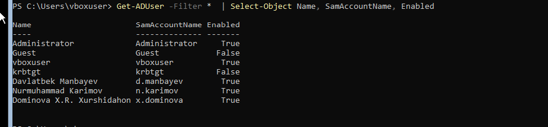
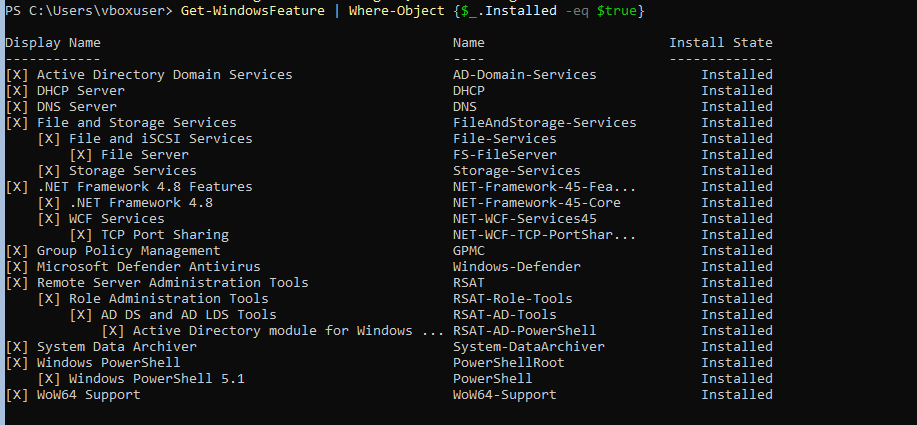

# Windows Server Lab: Развертывание и администрирование инфраструктуры

Практический проект по проектированию, настройке и администрированию серверной инфраструктуры на базе **Windows Server 2022 (включая Server Core)**. В ходе проекта была развернута тестовая корпоративная инфраструктура с базовыми сетевыми службами.
---
##  Технологический стек и инструменты
* **ОС сервера:** Windows Server 2022 Standard (Server Core)
* **ОС клиента:** Windows 10/11 Professional
* **Среда виртуализации:** Oracle VM VirtualBox
* **Автоматизация и CLI:** PowerShell, CMD, Sconfig
* **Службы и роли:** Active Directory Domain Services (AD DS), DNS-сервер, DHCP-сервер, File Server
---
## Структура проекта


## Project Structure

```text
Windows-Server-Lab/
│
├── README.md
│
├── screenshots/
│   ├── server-core/
│   ├── active-directory/
│   ├── dns-dhcp/
│   └── client-domain/
│
├── scripts/
│   ├── system-info.ps1
│   ├── check-services.ps1
│   └── shutdown-server.ps1
│
└──diagrams/
   └── network_architecture.png

```
#  Архитектура лабораторной сети (Network Topology)
Инфраструктура развернута внутри изолированной сети VirtualBox Network. Взаимодействие узлов и доменная структура организованы следующим образом:


##  Что было реализовано в рамках проекта

### 1. Подготовка и базовая настройка Windows Server Core
* Развернута оптимизированная редакция **Windows Server Core 2022** на узле `DC-01` для снижения утилизации ресурсов хоста, уменьшения размера дискового пространства и повышения безопасности системы за счет минимизации поверхности атаки.
* Проведена первичная инициализация и конфигурация сетевых интерфейсов (задан статический IPv4-адрес, маска, шлюз, DNS) и переименование серверов через встроенную утилиту `sconfig` и PowerShell CLI.

### 2. Развертывание доменных служб (Active Directory & Network Services)
* Развернута роль **AD DS**, создан новый лес и доменная зона `lab.local`.
* Настроен локальный **DNS-сервер** для корректного разрешения доменных имен внутри тестовой лаборатории.
* Сконфигурирован **DHCP-сервер** с пулом адресов для автоматической конфигурации сетевых параметров клиентских машин (узел `CLIENT-01`).
* Успешно выполнена процедура ввода клиентской рабочей станции `CLIENT-01` в домен `lab.local`.

### 3. Файловые ресурсы и разграничение прав

* На контроллере домена DC-01 настроены общие сетевые ресурсы для проверки доступа пользователей домена.
* Созданы общие папки (Shared Folders) и проверен доступ к ним через сетевое окружение.
* Настроено разграничение прав доступа на уровне NTFS и Share Permissions для пользователей домена.
* Проверена доступность системных доменных ресурсов NETLOGON и SYSVOL.

### 4. Консольное администрирование и автоматизация обслуживания
* Отработаны навыки полноценного администрирования ОС Windows Server без использования графической оболочки (GUI).
* Протестированы сценарии безопасного, удаленного и корректного завершения работы системных служб и самого сервера. 
* Реализована автоматизация процессов перезагрузки и выключения серверов с помощью PowerShell (Restart-Computer, Stop-Computer) и командной утилиты Windows shutdown.

## Скрипты PowerShell

Проект включает скрипты PowerShell, созданные для задач администрирования и автоматизации Windows Server.

Включенные скрипты:

- `system-info.ps1` — собирает основную информацию о сервере (имя хоста, конфигурация IP-адреса, сведения об ОС)
- `check-services.ps1` — проверяет состояние важных служб (AD DS, DNS, DHCP)
- `create-users.ps1` — автоматизирует пользователей в Active Directory
---

##  Траблшутинг и оптимизация тестового стенда

* **Оптимизация производительности:** При одновременном запуске контроллера домена, файлового сервера и клиентской машины на рабочей станции администратора возникала высокая нагрузка на аппаратную часть (CPU и RAM). Проблема была решена развертыванием ключевых ролей на базе редакции **Server Core**. Это позволило снизить потребление оперативной памяти сервером `DC-01` в режиме простоя до ~1.2 ГБ (вместо 2.5+ ГБ у версии с GUI) и обеспечило плавную работу всего стенда.
* **Обеспечение целостности данных при выключении:** Чтобы исключить повреждение доменной базы данных `NTDS.dit` и файлов на общем сервере при внезапном или некорректном завершении работы ВМ, были внедрены и задокументированы CLI-скрипты для контролируемого закрытия активных пользовательских сессий перед остановкой ОС.

---
##  Результаты тестирования и демонстрация работы

Ниже представлены подтверждения успешного развертывания и функционирования элементов лабораторного стенда:

### 1. Тестирование сетевых служб и статуса Server Core
В ходе первоначальной настройки контроллера домена на базе Server Core через утилиту `sconfig` были успешно применены сетевые параметры, изменено имя хоста на `DC-01` и инициализирован домен `lab.local`:


### 2. Верификация сетевых параметров интерфейса через PowerShell
С помощью команды `ipconfig /all` выполнена проверка сетевой конфигурации контроллера домена. Настроен статический IPv4-адрес, отключенный DHCP-клиент на сервере, а также корректное указание локального DNS-сервера (`127.0.0.1`) для обслуживания доменной зоны:


### 3.Доступ к общим ресурсам файлового сервера с клиента
Проверена доступность сетевых каталогов на сервере `DC-01` с клиентской рабочей станции. Отображаются системные доменные директории (`netlogon`, `sysvol`), а также пользовательская общая папка `CompanyShare`:


### 4. Верификация учетных записей пользователей Active Directory
С помощью командлета `Get-ADUser -Filter *` в среде PowerShell выполнена итоговая проверка наполнения базы данных Active Directory. Запрос успешно вывел как встроенные системные записи, так и созданные вручную учетные записи доменных сотрудников с корректно настроенными именами входа (`SamAccountName`) и подтвержденным активным статусом (`Enabled: True`):



### 5. Верификация установленных ролей Windows Server
Для финальной проверки конфигурации контроллера домена `DC-01` был выполнен аудит установленных компонентов через PowerShell. Фильтрация по флагу `Installed` наглядно подтверждает успешное развертывание и активность всех целевых инфраструктурных ролей (AD DS, DNS, DHCP и файловые службы) без лишнего задействования неиспользуемого функционала операционной системы:



## Future Improvements (Планируемые улучшения)

Для приближения лабораторного стенда к реальной enterprise-инфраструктуре планируется реализация следующих этапов:

* **Внедрение групповых политик (GPO):** Разработка и применение базовых доменных политик безопасности, включая требования к сложности паролей, автоматическое монтирование сетевых дисков (`CompanyShare`) для пользователей и ограничение прав на запуск нежелательного ПО.
* **Резервное копирование (Backup Strategy):** Настройка автоматического бэкапа состояния системы (System State) контроллера домена и критически важных данных файлового сервера с использованием PowerShell и средств Windows Server Backup.
* **Переход к Infrastructure as Code (IaC):** Полная автоматизация развертывания ролей AD DS, DNS и DHCP на новых серверах Server Core с использованием сценариев PowerShell Desired State Configuration (DSC).
* **Мониторинг и логирование:** Интеграция базового сбора логов безопасности и производительности сервера для отслеживания утилизации процессора, памяти и дисковой подсистемы.
* **Интеграция с СУБД:** Развертывание и настройка сервера баз данных (например, MS SQL Server) в доменной среде для симуляции работы реальных корпоративных и внутренних банковских систем.

## Продемонстрированные навыки

- Администрирование Windows Server
- Управление Active Directory
- Настройка DNS и DHCP
- Администрирование Server Core
- Автоматизация PowerShell
- Устранение неполадок в сети
- Управление общим доступом к файлам и правами доступа
